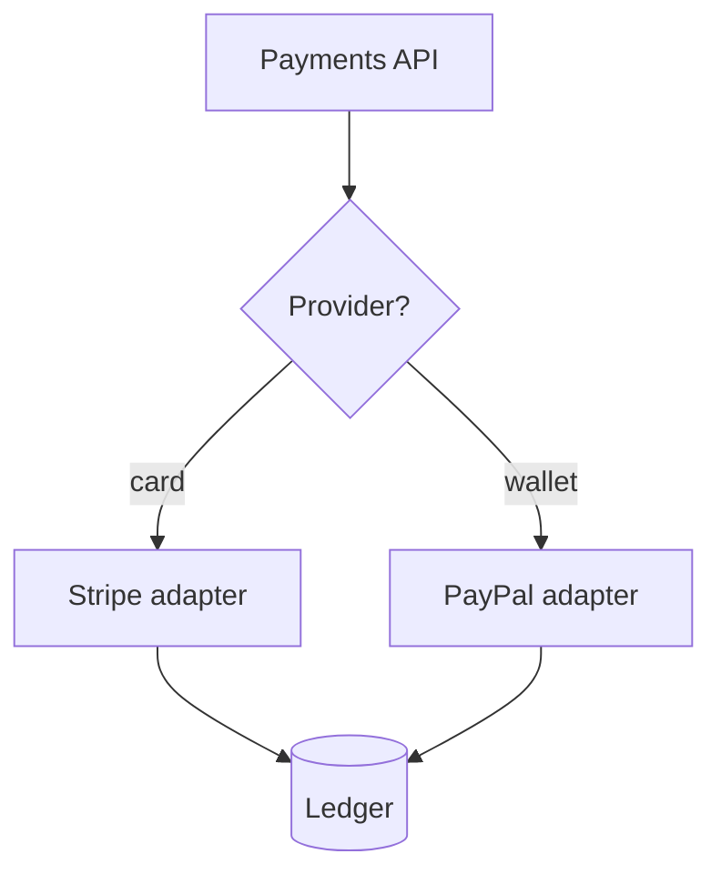

# Payments

Linked from the system overview (`click payments href "./payments.md"`).

```mermaid
flowchart TD
    api[Payments API] --> router{Provider?}
    router -->|card| stripe[Stripe adapter]
    router -->|wallet| paypal[PayPal adapter]
    stripe --> ledger[(Ledger)]
    paypal --> ledger
```
